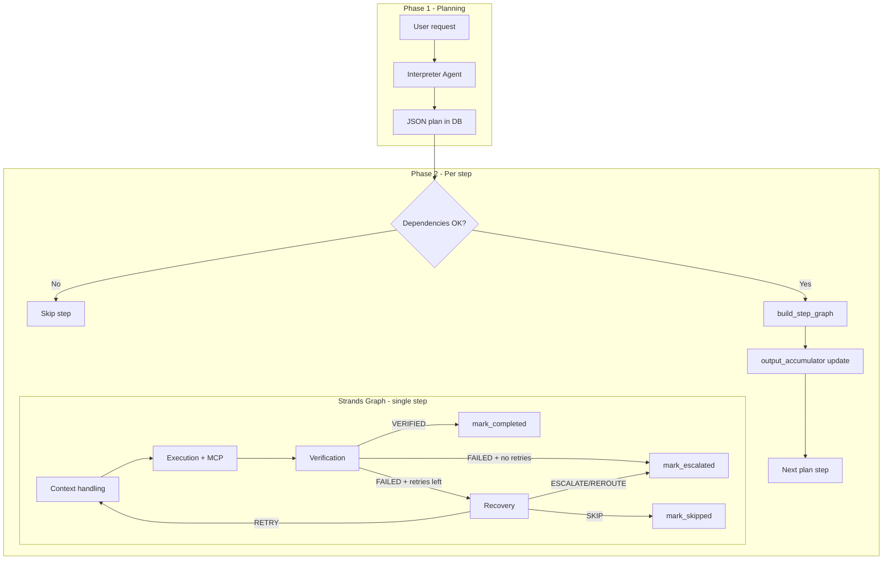

# Agents, Orchestrator, and Multi-Agent Flow

This document describes how the `backend/agents` and `backend/orchestrator` packages work together: each agent’s role, how the **Strands** SDK is used (including the **graph** pattern), and how **state** moves between planner, per-step pipeline, and downstream steps.

---

## 1. High-level architecture

The system is a **two-phase** pipeline:

1. **Planning (Interpreter)** — One Strands `Agent` turns the user request into an ordered JSON plan (steps with `tool_name`, `parameters`, `depends_on`, `assigned_agent`, `fallback`). No tools are called here; the agent is a “workflow compiler.”

2. **Execution (Orchestrator + per-step graph)** — The **workflow engine** walks the plan sequentially. For **each** step it builds a fresh **Strands `Graph`**: context handling → execution → verification → (conditional) completion, recovery, escalation, or skip. MCP tools are bound only to the **execution** and **recovery** agents.

Cross-cutting concerns:

- **PostgreSQL** stores workflows, steps, audit logs, and agent logs (`db` / Prisma-backed schema summarized in `agents/db_schema.py`).
- **SSE** streams UI updates via an in-memory queue plus optional stream replay (`state_manager.append_stream_event` / `get_stream_events`).
- **`agents/db_schema.py`** injects the same database mental model into interpreter, context handling, and execution prompts so SQL and parameter resolution stay consistent.

---

## 2. The `agents` package

### 2.1 Shared infrastructure (`agents/__init__.py`)

- **`get_model()`** — Builds a Strands `OpenAIModel` from `OPENAI_API_KEY`, `OPENAI_BASE_URL`, and `OPENAI_MODEL_ID`.
- **`get_mcp_client()`** — Returns a Strands `MCPClient` that spawns `backend/mcp_server.py` over stdio so tools run in a subprocess.

These are the **runtime dependencies** for any agent that needs the LLM or MCP.

### 2.2 Interpreter agent (`interpreter_agent.py`)

**Role:** Convert natural language into a **JSON array of steps** that obey workflow “contracts” (onboarding, meeting-to-action, etc.).

**Strands usage:**

- `Agent(system_prompt=..., model=..., tools=[], ...)` — **No tools** at plan time; the model must not call MCP during planning.
- Prompt is built dynamically: **`DB_SCHEMA_CONTEXT`** replaces `# DB_SCHEMA_INJECTED_AT_RUNTIME`, and **`fetch_mcp_tools()`** replaces `# TOOL_MANIFEST_INJECTED_AT_RUNTIME` so the plan only references tools that actually exist.

**Output contract (per step):**

- `step_id`, `name`, `tool_name`, `parameters`, `depends_on`, `assigned_agent` (typically `"execution"`), `fallback` (`RETRY` | `ESCALATE` | `SKIP`).

**`generate_plan(agent, user_request)`** — Synchronously invokes the agent (`agent(prompt)`), then parses the first `[...]` JSON array from the text response.

**Contribution to orchestration:** Defines **what** runs and in **what dependency order**. Runtime retries/escalations are **not** expressed as conditional branches in the plan; the interpreter is instructed to plan the **happy path** only, while the **recovery graph** handles failures.

### 2.3 Context handling agent (`context_handling_agent.py`)

**Role:** Before tool execution, **resolve** empty or placeholder step parameters using **workflow context** (outputs from prior completed steps). It does **not** execute tools, verify output, or decide retries.

**Strands usage:** `Agent` with **empty `tools=[]`**.

**Output JSON shape:**

- `resolved_parameters` — Must include every key from “Current Parameters”; values may be filled from context.
- `context_updates` — Optional compact additions for downstream steps.
- `missing_required`, `reason`.

**Contribution to orchestration:** Bridges **prior step outputs** into **concrete arguments** for the current tool call, including SQL query completion for `execute_sql` when the query was left empty at plan time.

### 2.4 Execution agent (`execution_agent.py`)

**Role:** Given **one** step (tool + parameters + workflow context), **call exactly that MCP tool once** and return a strict JSON envelope:

```json
{
  "status": "SUCCESS" | "FAILURE",
  "tool_called": "<name>",
  "output": <parsed tool payload or null>,
  "error": "<string or null>"
}
```

**Strands usage:** `Agent` with **`tools=mcp_client_tools`** (MCP client as a tool provider).

**Important contract:** The orchestrator expects the **full tool envelope** in `output` (e.g. `{ "success", "data", "tool" }`) where applicable — not only the inner `data` — for governance and UI.

**Contribution to orchestration:** The only node that **invokes enterprise actions** (SQL, email, JIRA, etc.) during normal execution.

### 2.5 Verification agent (`verification_agent.py`)

**Role:** Independent **QC** on execution output: `VERIFIED` vs `FAILED`, confidence, reason, optional `suggested_recovery`.

**Strands usage:** `Agent` with **no tools** — pure reasoning over the execution JSON.

**Contribution to orchestration:** Provides a second opinion before a step is marked complete; the graph also applies **deterministic** bypass rules (see §4) before calling the LLM verifier.

### 2.6 Recovery agent (`recovery_agent.py`)

**Role:** After a failed verification (or exhausted deterministic paths), decide **RETRY**, **ESCALATE**, **SKIP**, or **REROUTE**, optionally with `modified_parameters` or an **escalation tool** + parameters, plus an **audit_message**.

**Strands usage:** `Agent` with **MCP tools** so it can drive `escalate_to_it_tool`, `reroute_approval_tool`, etc., when the chosen action requires it.

**Contribution to orchestration:** Implements **resilience policy** the interpreter deliberately does not encode as “if failed then …” steps in the plan.

### 2.7 Shared DB schema context (`db_schema.py`)

**Role:** Single source of truth string (`DB_SCHEMA_CONTEXT`) describing PostgreSQL tables (`employees`, `workflows`, `steps`, `audit_logs`, `agent_logs`) and query conventions.

**Contribution:** Aligns **planning**, **parameter resolution**, and **SQL generation** across agents without duplicating schema drift.

### 2.8 Agent summary table

| Agent              | Tools (Strands) | Primary output                         |
|-------------------|-----------------|----------------------------------------|
| Interpreter       | None            | JSON plan (array of steps)             |
| Context handling  | None            | `resolved_parameters` + `context_updates` |
| Execution         | MCP             | Tool result envelope JSON              |
| Verification      | None            | Verdict JSON                           |
| Recovery          | MCP             | Recovery decision JSON (+ may call tools) |

---

## 3. The `orchestrator` package

### 3.1 `workflow_engine.py` — outer loop

**Responsibilities:**

1. Set workflow status (`PLANNING` → `RUNNING` → terminal).
2. Run **`get_interpreter_agent()`** and **`generate_plan()`**.
3. Replace `__WORKFLOW_ID__` placeholders in plan parameters with the real UUID.
4. **`_post_plan_sanity_filter`** — Drops structurally bad `execute_sql` steps (e.g. reckless `SELECT * FROM employees` with no `WHERE`).
5. Persist plan and **create `steps` rows** in the database; emit SSE `plan`.
6. For each plan step in order:
   - Evaluate **`depends_on`** with **hard vs soft** dependency semantics (`_SOFT_DEP_TOOLS` allows downstream steps to run when a dependency was `ESCALATED` or `SKIPPED`).
   - Refresh MCP clients if unhealthy.
   - **`_repair_onboarding_sql_params`** — Deterministic fix for broken buddy `UPDATE` when context implies a real buddy name.
   - Call **`build_step_graph(...)`** then **`graph.stream_async(...)`** until the graph finishes.
   - Read **`graph_state`** for `final_status` and `exec_output`; update **`step_results`** and **`output_accumulator`** (see §5).
7. Summarize counts (completed / escalated / skipped / failed / ambiguous tasks) and emit **`workflow_complete`**.

The interpreter and the per-step graph are **orthogonal**: the graph does not parse the whole plan; it only executes **one** step’s context.

### 3.2 `graph.py` — Strands graph pattern per step

#### 3.2.1 Why a graph?

Strands provides **`GraphBuilder`** and multi-agent primitives. This codebase uses a **compiled graph per step** (not one global graph for the whole workflow) because:

- Step-specific context (`step_id`, `tool_name`, `parameters`, `workflow_context`) is **closed over** in node functions.
- The SDK is used in a way that matches **stateful** Python async functions tied to each invocation.

#### 3.2.2 `FunctionNode` — bridging lambdas to `MultiAgentBase`

Strands graph nodes expect **`MultiAgentBase`** subclasses. **`FunctionNode`** subclasses `MultiAgentBase` and implements **`invoke_async`**, which:

1. Calls the wrapped async Python function `(task_str, invocation_state)`.
2. Wraps the string result in **`AgentResult`** / **`MultiAgentResult`** with `Status.COMPLETED`.

So “orchestration logic” stays in plain async functions while remaining valid graph nodes.

#### 3.2.3 Node sequence and conditional edges

**Nodes:**

| Node id            | Purpose                                      |
|--------------------|----------------------------------------------|
| `context_handling` | Resolve parameters; update shared `state`  |
| `execution`        | Stream execution agent; MCP tool call        |
| `verification`     | Deterministic + optional LLM verdict         |
| `recovery`         | Increment retry; decide next action; optional escalation tool |
| `mark_completed`   | DB: step `COMPLETED`, audit, SSE             |
| `mark_escalated`   | DB: step `ESCALATED`, audit, SSE             |
| `mark_skipped`     | DB: step `SKIPPED`, SSE                      |

**Entry:** `context_handling`.

**Fixed edges:**

- `context_handling` → `execution` → `verification`

**Conditional edges from `verification`:**

- → `mark_completed` if `verify_verdict == "VERIFIED"`.
- → `recovery` if not verified **and** `retry_count < max_retries` (default `max_retries = 2`; routing uses **before** recovery increments in the failure path — see code: `route_needs_recovery` checks `retry_count < max_retries`).
- → `mark_escalated` if not verified **and** `retry_count >= max_retries`.

**Conditional edges from `recovery`:**

- → `context_handling` if `recovery_action == "RETRY"` (loop: context again → execute again).
- → `mark_escalated` if `ESCALATE` or `REROUTE`.
- → `mark_skipped` if `SKIP`.

**Safety:** `set_max_node_executions(15)` and `set_execution_timeout(300)` cap runaway graphs.

#### 3.2.4 Deterministic layers inside the graph

Not everything is LLM-driven:

- **`TOOL_REQUIRED_PARAMS`** / **`_validate_params`** — Declared for documentation-style validation (execution path also merges context handling output).
- **`_classify_error`** — Maps execution output to `SUCCESS`, `ACCESS_DENIED`, `TRANSIENT_INFRA`, etc.
- **Verification bypass** — If classification is `SUCCESS`, verification short-circuits to `VERIFIED` without calling the verification agent. Certain error classes short-circuit to `FAILED`.
- **Recovery max retries** — If `retry_count > max_retries`, recovery forces `ESCALATE` before invoking the recovery agent.
- **`workflow_id` guardrails** — Canonical workflow UUID is forced onto `workflow_id` parameters so context resolution cannot substitute an employee row `id`.

#### 3.2.5 Streaming

**`_stream_agent`** consumes **`agent.stream_async(prompt)`**, forwards chunks as SSE (`token_stream`, `agent_tool_start`, etc.), and falls back to **`asyncio.to_thread(agent, prompt)`** on failure. This is how the UI sees partial LLM output during context, execution, verification, and recovery.

---

## 4. How multi-agent orchestration works end-to-end



**Key idea:** “Multi-agent” here means **several specialized Strands `Agent` instances** (different system prompts and tool sets) orchestrated by:

1. A **Python for-loop** over the plan (sequential steps, dependency gating).
2. A **Strands graph** inside each iteration (context → execute → verify → recover loop).

The **interpreter** is not inside the graph; it runs **once** up front.

---

## 5. How state is shared between agents

State lives at three layers: **workflow-level accumulator**, **per-step graph closure**, and **persistence**.

### 5.1 `output_accumulator` (workflow engine)

After each step completes successfully, the engine extracts tool payload data and merges it into a **single dict** passed to the next step as `step_context["workflow_context"]`:

- **`output_accumulator[plan_step_id]`** — Structured `data` from the tool envelope (dict or list).
- **Aliases for robustness:**
  - `_last_step_id`, `_last_tool_name`, `_last_output`
  - `_last_tool_output_<tool_name>`
  - For `execute_sql` list results: `_last_emails_list`, `_last_emails_csv`

The **context handling** node also writes:

- **`workflow_context[f"context_step_{step_id}"]`** — The interpreter/context agent’s `context_updates` for that step.

So downstream **context handling** and **execution** prompts see both **raw tool outputs keyed by step id** and **semantic aliases**.

### 5.2 Graph `state` dict (`build_step_graph`)

Inside `build_step_graph`, a **mutable `state`** dictionary is shared across all `FunctionNode` closures for that step:

- **Inputs from engine:** `workflow_id`, `step_id`, `step_name`, `tool_name`, `parameters`, `step_db_id`, `workflow_context` (copy of accumulator at step start).
- **Execution pipeline:** `resolved_parameters`, `exec_output`, `verify_verdict`, `recovery_action`, `recovery_params`, `retry_count`, `final_status`, etc.

**Retry path:** On `RETRY`, recovery may set `recovery_params`; **context handling** prefers `recovery_params` over original `parameters` when resolving again.

This **`state` is not the Strands `invocation_state` from the framework** in the sense of serializable cross-run state; it is **Python closure state** for one graph run.

### 5.3 Database and SSE

- **`db.log_agent_action`** — Records execution, verification, and orchestrator actions with inputs/outputs.
- **`db.log_audit`** — Recovery and completion decisions.
- **`db.update_step`** — Step status transitions.
- **`emit` / SSE queue** — Real-time UI; optional **`append_stream_event`** for replay.

### 5.4 What is *not* shared automatically

- The **verification** agent only sees **current step execution output** in its prompt, not the full accumulator (the execution agent’s prompt does include workflow context).
- The **interpreter** does not see runtime tool results; it runs before any tool execution.
- **Parallelism:** Steps do not run in parallel; the outer loop is strictly sequential, respecting `depends_on` only for **skip** logic, not for concurrent execution.

---

## 6. Strands-specific concepts used in this repo

| Concept              | Usage here |
|----------------------|------------|
| `Agent`              | LLM + optional tools; constructed per role |
| `OpenAIModel`        | OpenAI-compatible API client configuration |
| `MCPClient`          | Stdio MCP tool server wired as Strands tools |
| `GraphBuilder`       | Nodes, edges, conditions, limits, timeout |
| `MultiAgentBase`     | Implemented by `FunctionNode` for custom nodes |
| `NodeResult` / `MultiAgentResult` | Wrapping custom node outputs |
| `graph.stream_async` | Drives graph execution; node functions perform real work + SSE |

The **“graph pattern”** in this project is specifically: **compile a small DAG per step** whose nodes are either **Strands agents** (invoked inside `FunctionNode` functions) or **pure side-effect nodes** (mark completed/escalated/skipped), with **closure-captured `state`** implementing the **exec → verify → recover** loop.

---

## 7. File map

| Path | Role |
|------|------|
| `backend/agents/__init__.py` | Shared model + MCP client factories |
| `backend/agents/db_schema.py` | Shared schema context string |
| `backend/agents/interpreter_agent.py` | Planning agent + MCP tool manifest injection |
| `backend/agents/context_handling_agent.py` | Parameter resolution agent |
| `backend/agents/execution_agent.py` | MCP tool execution agent |
| `backend/agents/verification_agent.py` | Output verification agent |
| `backend/agents/recovery_agent.py` | Failure handling + escalation tools |
| `backend/orchestrator/workflow_engine.py` | Interpret → loop steps → graph → SSE → DB |
| `backend/orchestrator/graph.py` | `FunctionNode`, `build_step_graph`, streaming helpers |

---

*Generated from the codebase as of the documented structure; adjust if you rename modules or change graph routing.*
