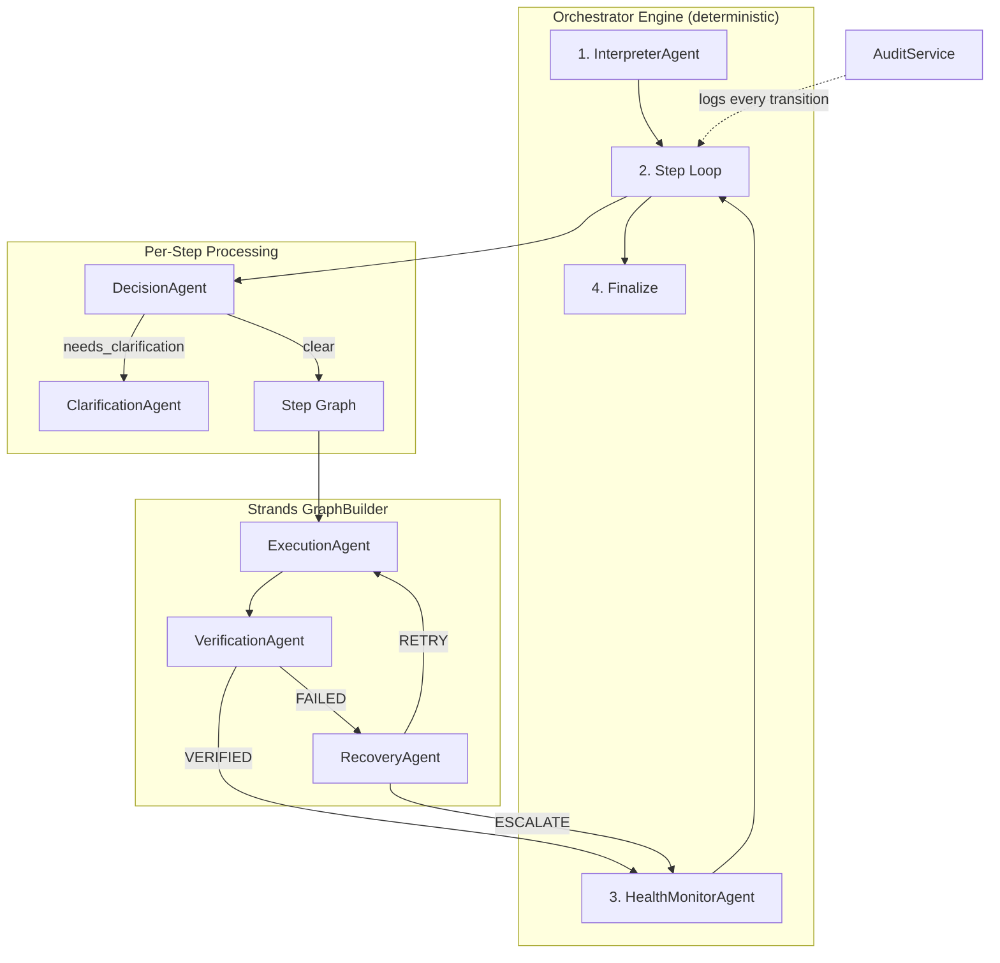

# Enterprise Autopilot — Multi-Agent Refactoring Walkthrough

## Architecture Overview

## What Changed

### Backend — New Modular Structure

| Directory | Files | Purpose |
|-----------|-------|---------|
| `agents/` | 9 files | Specialized agents: Interpreter, Decision, Execution, Verification, Recovery, Clarification, HealthMonitor |
| `orchestrator/` | 4 files | Deterministic engine, step graph, SSE streaming |
| `services/` | 2 files | Audit logging service |

**Key files:**
- [engine.py](file:///d:/ET-2/backend/orchestrator/engine.py) — Deterministic state machine, no LLM calls
- [step_graph.py](file:///d:/ET-2/backend/orchestrator/step_graph.py) — Strands GraphBuilder (Execute→Verify→Recover)
- [interpreter.py](file:///d:/ET-2/backend/agents/interpreter.py) — Converts any intent to structured step plan
- [audit.py](file:///d:/ET-2/backend/services/audit.py) — System-level structured audit logging

### MCP Tools Added
- [create_task_tool](file:///d:/ET-2/backend/mcp_server.py#597-629) — meeting-to-action task creation
- [send_summary_email_tool](file:///d:/ET-2/backend/mcp_server.py#634-664) — summary email dispatch
- [reroute_approval_tool](file:///d:/ET-2/backend/mcp_server.py#669-702) — stuck approval rerouting

### Frontend
- [page.tsx](file:///d:/ET-2/src/app/workflows/%5Bid%5D/page.tsx) — 4-panel execution console (step list, agent chat, roster, audit)
- [globals.css](file:///d:/ET-2/src/app/globals.css) — Added `--purple`, `--cyan`, `--teal`, `--orange` + new badges

## Verification

| Check | Result |
|-------|--------|
| `from orchestrator.engine import execute_workflow` | ✅ Imports cleanly |
| All 7 agent modules import | ✅ `ALL MODULES OK` |
| [AuditService](file:///d:/ET-2/backend/services/audit.py#8-111) import | ✅ OK |
| Old [orchestrator.py](file:///d:/ET-2/backend/orchestrator.py) removed | ✅ Renamed to [orchestrator_legacy.py](file:///d:/ET-2/backend/orchestrator_legacy.py) |
| File count: 15 new Python files | ✅ Confirmed via `find_by_name` |

## Next Steps (User Action)

1. **Restart the backend**: `.\venv\Scripts\python main.py` in `d:\ET-2\backend`
2. **Test onboarding**: Add a new employee via the dashboard → watch the 4-panel console
3. **Test custom workflow**: Create a workflow like *"Schedule a team building event and send invites"*
4. **Delete** `orchestrator_legacy.py` once satisfied
